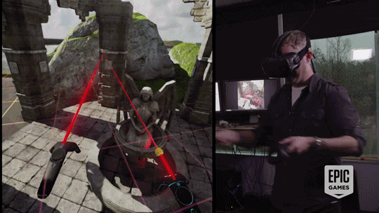

                                                # Unreal-Engine-Environment
                                                
Making an environment to be displayed in vr headset using Unreal Engine

                                                    Software considered.

Unity.
Unity is a cross-platform game engine with a built-in IDE developed by Unity Technologies. It is used to develop video games for web plugins, desktop platforms, consoles and mobile devices.

Unreal Engine
Unreal Engine 4 is a complete suite of development tools made for anyone working with real-time technology. From enterprise applications and cinematic experiences to high-quality games across PC, console, mobile, VR and AR, Unreal Engine 4 gives you everything you need to start, ship, grow and stand out from the crowd.

                                                What I will be using?
                                                

C++ is a high-level programming language developed by Bjarne Stroustrup at Bell Labs. C++ adds object-oriented features to its predecessor, C. C++ is one of the most popular programming language for graphical applications, such as those that run in Windows and Macintosh environments.

  
I will be using C++ and blueprints to build my Environment for the VR experience.
  
Blueprints is the visual scripting system inside Unreal Engine 4 and is a fast way to start prototyping your game. Instead of having to write code line by line, you do everything visually: drag and drop nodes, set their properties in a UI, and drag wires to connect.

